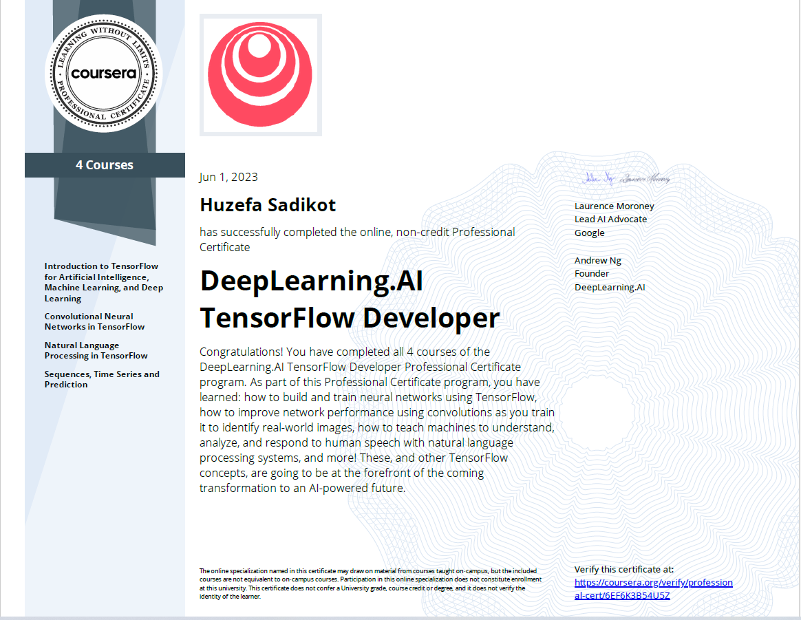

## Deep Learning.AI Tensorflow Developer Certificate

## 1. Introduction to TensorFlow for Artificial Intelligence, Machine Learning, and Deep Learning
   
# About this Course
   If you are a software developer who wants to build scalable AI-powered algorithms, you need to understand how to use the tools to build them. This course is part of the upcoming Machine Learning in Tensorflow Specialization and will teach you best practices for using TensorFlow, a popular open-source framework for machine learning. The Machine Learning course and Deep Learning Specialization from Andrew Ng teach the most important and foundational principles of Machine Learning and Deep Learning. This new deeplearning.ai TensorFlow Specialization teaches you how to use TensorFlow to implement those principles so that you can start building and applying scalable models to real-world problems. To develop a deeper understanding of how neural networks work, we recommend that you take the Deep Learning Specialization.

## 2. Convolutional Neural Networks In Tensorflow:

# About this Course
If you are a software developer who wants to build scalable AI-powered algorithms, you need to understand how to use the tools to build them. This course is part of the upcoming Machine Learning in Tensorflow Specialization and will teach you best practices for using TensorFlow, a popular open-source framework for machine learning.

In Course 2 of the deeplearning.ai TensorFlow Specialization, you will learn advanced techniques to improve the computer vision model you built in Course 1. You will explore how to work with real-world images in different shapes and sizes, visualize the journey of an image through convolutions to understand how a computer “sees” information, plot loss and accuracy, and explore strategies to prevent overfitting, including augmentation and dropout. Finally, Course 2 will introduce you to transfer learning and how learned features can be extracted from models.

The Machine Learning course and Deep Learning Specialization from Andrew Ng teach the most important and foundational principles of Machine Learning and Deep Learning. This new deeplearning.ai TensorFlow Specialization teaches you how to use TensorFlow to implement those principles so that you can start building and applying scalable models to real-world problems. To develop a deeper understanding of how neural networks work, we recommend that you take the Deep Learning Specialization.

## 3. Natural Language Processing In Tensorflow:

# About this Course
If you are a software developer who wants to build scalable AI-powered algorithms, you need to understand how to use the tools to build them. This Specialization will teach you best practices for using TensorFlow, a popular open-source framework for machine learning.

In Course 3 of the deeplearning.ai TensorFlow Specialization, you will build natural language processing systems using TensorFlow. You will learn to process text, including tokenizing and representing sentences as vectors, so that they can be input to a neural network. You’ll also learn to apply RNNs, GRUs, and LSTMs in TensorFlow. Finally, you’ll get to train an  LSTM on existing text to create original poetry!

The Machine Learning course and Deep Learning Specialization from Andrew Ng teach the most important and foundational principles of Machine Learning and Deep Learning. This new deeplearning.ai TensorFlow Specialization teaches you how to use TensorFlow to implement those principles so that you can start building and applying scalable models to real-world problems. To develop a deeper understanding of how neural networks work, we recommend that you take the Deep Learning Specialization.

## 4. Sequences, Time Series and Prediction

# About this Course
If you are a software developer who wants to build scalable AI-powered algorithms, you need to understand how to use the tools to build them. This Specialization will teach you best practices for using TensorFlow, a popular open-source framework for machine learning.

In this fourth course, you will learn how to build time series models in TensorFlow. You’ll first implement best practices to prepare time series data. You’ll also explore how RNNs and 1D ConvNets can be used for prediction. Finally, you’ll apply everything you’ve learned throughout the Specialization to build a sunspot prediction model using real-world data!

The Machine Learning course and Deep Learning Specialization from Andrew Ng teach the most important and foundational principles of Machine Learning and Deep Learning. This new deeplearning.ai TensorFlow Specialization teaches you how to use TensorFlow to implement those principles so that you can start building and applying scalable models to real-world problems. To develop a deeper understanding of how neural networks work, we recommend that you take the Deep Learning Specialization.

### Programming Assignments:

## 1. Course 1: 

1. Week 1: https://github.com/Hsadikot95S/Tensorflow/blob/master/Introduction%20to%20Tensorflow/Week1/C1W1_Assignment.ipynb
2. Week 2: https://github.com/Hsadikot95S/Tensorflow/blob/master/Introduction%20to%20Tensorflow/Week2/C1W2_Assignment.ipynb
3. Week 3: https://github.com/Hsadikot95S/Tensorflow/blob/master/Introduction%20to%20Tensorflow/Week3/C1W3_Assignment.ipynb
4. Week 4: https://github.com/Hsadikot95S/Tensorflow/blob/master/Introduction%20to%20Tensorflow/Week4/C1W4_Assignment.ipynb

## 2. Course 2:

1. Week 1: https://github.com/Hsadikot95S/Tensorflow/tree/master/Convolutional%20Neural%20Networks%20In%20Tensorflow/Week1
2. Week 2: https://github.com/Hsadikot95S/Tensorflow/tree/master/Convolutional%20Neural%20Networks%20In%20Tensorflow/Week2
3. Week 3: https://github.com/Hsadikot95S/Tensorflow/blob/master/Convolutional%20Neural%20Networks%20In%20Tensorflow/Week3/C2W3_Assignment.ipynb
4. Week 4: https://github.com/Hsadikot95S/Tensorflow/blob/master/Convolutional%20Neural%20Networks%20In%20Tensorflow/Week4/C2W4_Assignment.ipynb

## 3. Course 3:

1. Week 1: https://github.com/Hsadikot95S/Tensorflow/blob/master/Natural%20Language%20Processing%20in%20Tensorflow/Week1/C3W1_Assignment.ipynb
2. Week 2: https://github.com/Hsadikot95S/Tensorflow/blob/master/Natural%20Language%20Processing%20in%20Tensorflow/Week2/C3W2_Assignment.ipynb
3. Week 3: https://github.com/Hsadikot95S/Tensorflow/blob/master/Natural%20Language%20Processing%20in%20Tensorflow/Week3/C3W3_Assignment.ipynb
4. Week 4: https://github.com/Hsadikot95S/Tensorflow/tree/master/Natural%20Language%20Processing%20in%20Tensorflow/Week4

## Course 4:

1. Week 1: https://github.com/Hsadikot95S/Tensorflow/blob/master/Sequence%20and%20Series/Week1/C4W1_Assignment.ipynb
2. Week 2: https://github.com/Hsadikot95S/Tensorflow/blob/master/Sequence%20and%20Series/Week2/C4W2_Assignment.ipynb
3. Week 3: https://github.com/Hsadikot95S/Tensorflow/blob/master/Sequence%20and%20Series/Week3/C4W3_Assignment.ipynb
4. Week 4: https://github.com/Hsadikot95S/Tensorflow/blob/master/Sequence%20and%20Series/Week4/C4W4_Assignment.ipynb